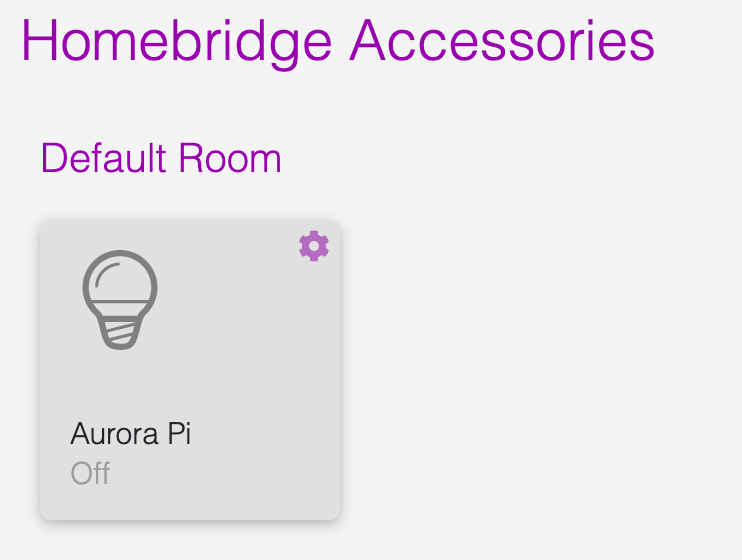

# homebridge-ambient-lights-aurora
Homebridge Ambient Lights - Aurora

This allows you to control the [Aurora Ambient LED Project](https://github.com/AndrewMohawk/Aurora) via Homekit.

<p align="center">


</p>

## Installation
npm i -g homebridge-ambient-lights-aurora

## Homebridge Configuration

Add the `HomeBridge - Ambient Lights Aurora` platform in your homebridge `config.json` file.  And set up at least 1 `auroras`

### Easiest configuration
For the best experience setting up this plugin, please use [homebridge-config-ui-x](https://www.npmjs.com/package/homebridge-config-ui-x) or [HOOBS](https://hoobs.org/).  Both have a UI that will walk you through adding required fields.

### Basic configuration
```json
{
    "platforms": [
        {
            "platform": "HomeBridge - Ambient Lights Aurora",
            "auroras": [
                {
                    "ipAddress": "192.168.1.190",
                    "piName": "Aurora Pi",
                    "extension": "Aurora_Ambient_AutoCrop"
                }
            ]
        }
    ]
}
```

## Switching Extensions

[Aurora Extensions](https://github.com/AndrewMohawk/Aurora/tree/master/extensions)
There are currently 5 active extensions made by Andrew.  Since this plugin uses a Lightbulb service the Brightness switches between Extension modes.

(I don't think this is totally logical, but I figure Audio is minimal brightness then worked by way up to the best modes)
- 100-80 - Autocrop
- 79-60  - No crop
- 59-40  - Rainbow
- 39-20  - Meteor
- 19-0   - Audio Spectogram

## Issues

Currently there is no easy way to grab the current status of the Aurora system so when the plugin initially runs it assumes Aurora is:

- Off
- Autocrop is the current Extension Loaded